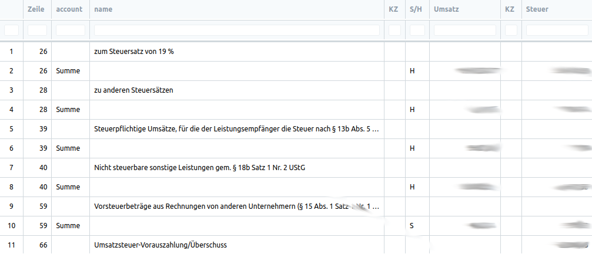
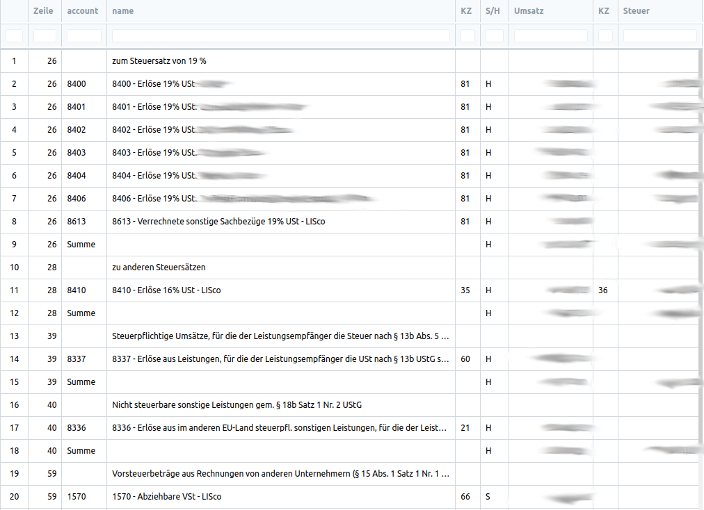
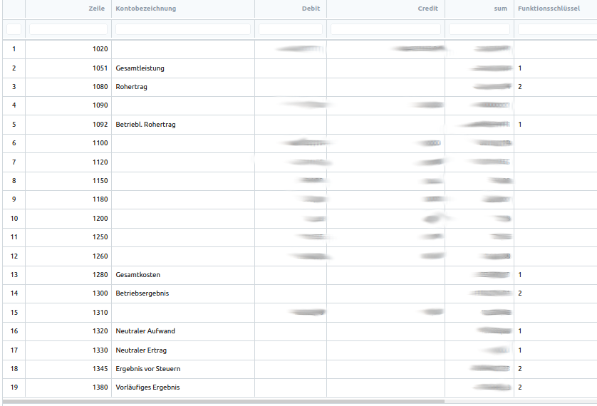
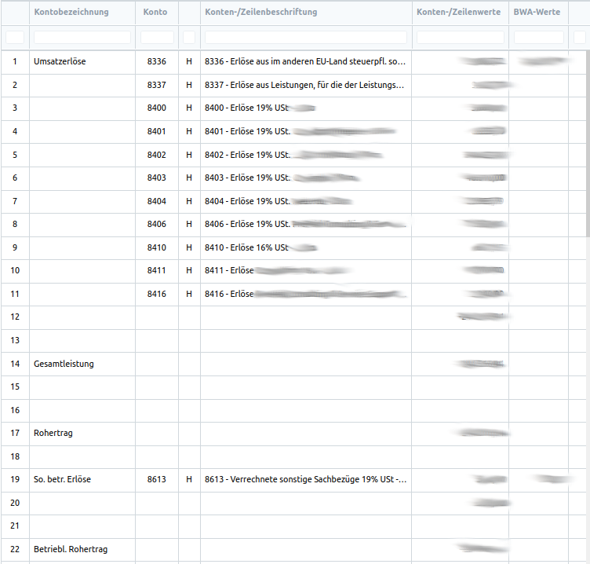
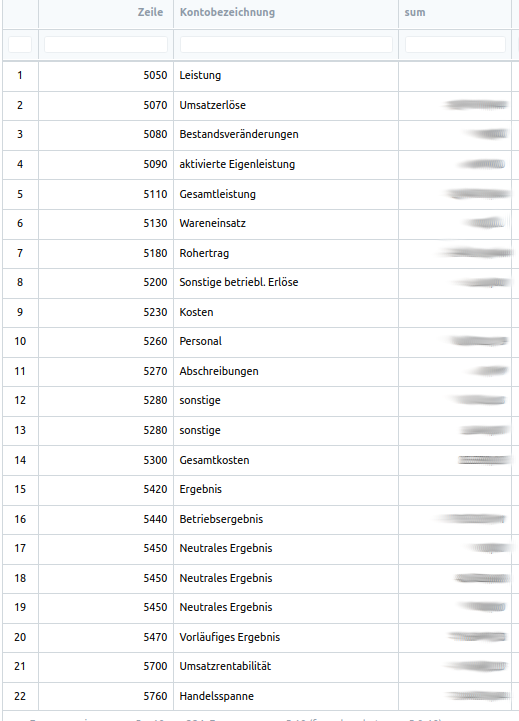
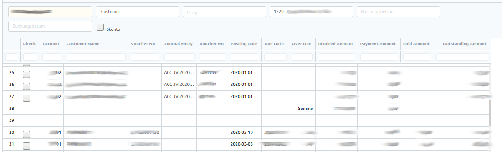

# German Accounting

Reports für die deutsche Buchhaltung wie z.B. die Betriebswirtschaftliche Auswertung (BWA) und  Umsatzsteuer Voranmeldung (UStVA) sowie OP-Liste.

Alle der oben genannten Buchhaltungsreports basieren auf Skript-Reports. Der logische Aufbau ist an dem aus der Datev-Doku (https://apps.datev.de/dnlexka/document/0906300, PDF S.59ff., 3.3 UStVA-Zeilenbeschreibung; 4.1 DATEV-BWA (BWA-Form 01); 5 Betriebswirtschaftlicher Kurzbericht), für die BWA und UStVA, orientiert. Die tabellarische Darstellungen haben wir an ähnlichen Reports aus einem anderen Buchhaltungsprogramm angelehnt.

## Umsatzsteuer Voranmeldung (UStVA)

Der UStVA-DocType beinhaltet folgende Felder:
- Kontonummer
- Kennzeichen
- Steuersatz
- Steuerkennzeichen
- Zeile

Bei diesem Report können folgende Filtereinstellungen ausgewählt werden
- von / bis
- Layout (Kontenansicht + Kurzansicht)

Es gibt zum einen die Kontenansicht die alle Konten, die bebucht sind, unter ihrer zugeordneten Zeile und dem Kennzeichen(KZ) detailliert aufgelistet werden. Zum anderen gibt es noch die Kurzansicht, die die Ergebnisse der Zeilen kumuliert und ohne die Konten aufzeigt.

# Kurzansicht:

# Kontenansicht:

## Betriebswirtschaftliche Auswertung (BWA)

Der BWA-Rport besitzt auch eigene DocTypes und beinhaltet folgende Felder:

BWA:
- Zeile
- Name
- Konto von
- Konto bis
- Typ
- Zeile von
- Zeile bis
- Funktionsschlüssel

BWA Kurzbericht:
- Zeile
- Name
- Konto von
- Konto bis
- Typ
- Zeile von
- Zeile bis
- Funktionsschlüssel
- BWA Funktion

Bei diesem Report können folgende Filtereinstellungen ausgewählt werden
- von / bis
- Layout (BWA, BWA Kontenansicht und BWA Kurzbericht)
- Vorjahresvergleich (Bei Kontenansicht)

# BWA:

# BWA Kontenansicht

# BWA Kurzbericht

## Offene Posten Liste (OP-Liste)

Der offene Posten Report (OP-Liste) ist eine übersicht über alle Rechnungen, die noch nicht bezahlt sind. In diesem Report können die einzelnen Rechnungen (Sales Invoice) angeklickt werden und via Button (Create Payment) eine Zahlung als Buchungssatz (Journal Entry) generiert werden. Es können auch Teilbuchungen pro Rechnung angegeben werden. Mit der Skonto-Checkbox können Skonto sowie Zahlungsdifferenzen entsprechend verbucht werden.

Es gäbe auch die Möglichkeit hierüber die Mahnungen zu kontrollieren, da dieser Report auch per Button Mahnungen erstellen könnte. In diesem Repo wird dies vermutlich nicht funktionieren, da wir dafür das Dunning-Modul von Alyf dementsprechend angepasst hatten, sodass in einer Mahnung mehrere Positionen gemahnt werden können und jede Position hat ihre eigene Mahnstufe, die bei jeder Mahnung automatisch hochzählt.

Die Filter von diesem Report sind:
- Unternehmen
- Kunde oder Lieferant (party_type)
- Kunden-/Lieferantennummer (Multiselect, abhängig von dem party_type)
- Bankkonto
- Rechnungsbetrag
- Buchungsdatum
- Skonto

# OP-Liste:

#### License

GPL3
